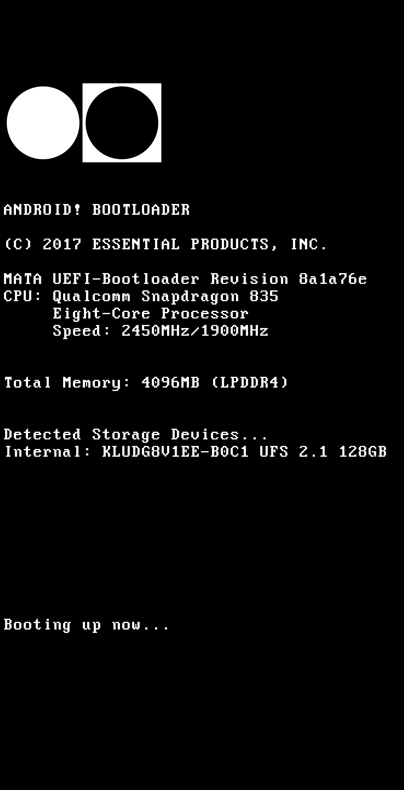

# Essential PH-1 BIOS splash
An AMIBIOS inspired boot splash for the Essential PH-1

## How to install
`fastboot flash splash splash.img`

## How to build
- You need to have the [Perfect DOS VGA 437 font](https://www.dafont.com/perfect-dos-vga-437.font) installed
- Open the .xcf file in GIMP and edit to your likings
- Export as → Microsoft Windows bmp (.bmp)
- Export to essential-splash.bmp
- Export settings:
  - Don't write color space information
  - Choose 24 Bit R8 G8 B8 color space
- Create splash.img with `cat header.img essential-splash.bmp > splash.img`

## License
  
This work is licensed under a [Creative Commons Attribution 4.0 International License](http://creativecommons.org/licenses/by/4.0/).

The header.img (which was extracted from an official splash.img by Essential) as well as general directions were taken from [this XDA thread](https://forum.xda-developers.com/essential-phone/how-to/guide-how-to-change-boot-logo-splash-t3706728) by GokulNC, thanks a lot!